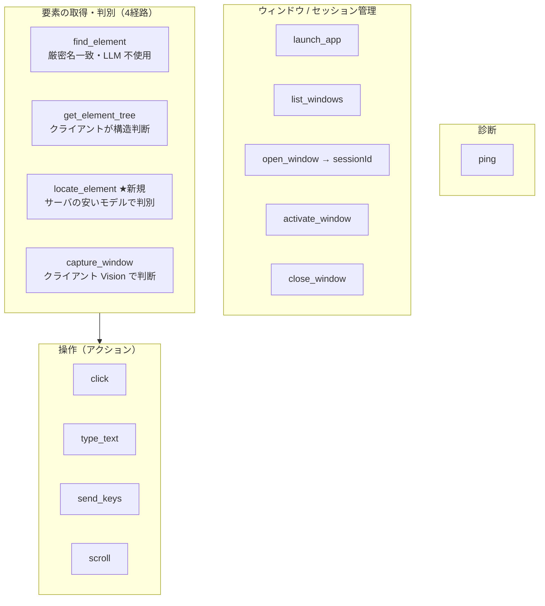
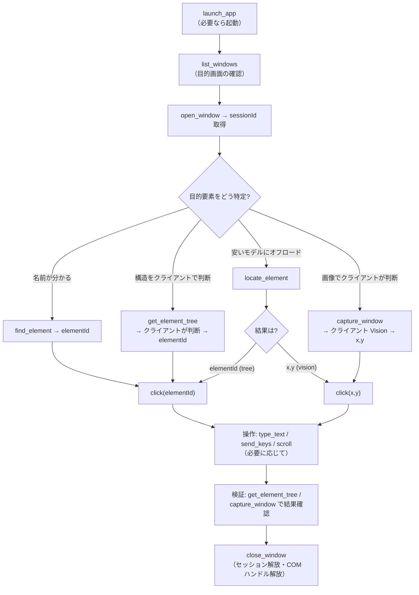
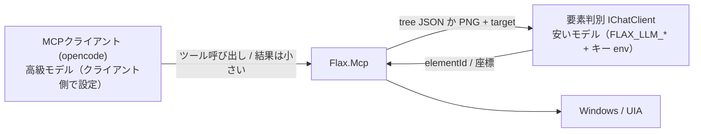
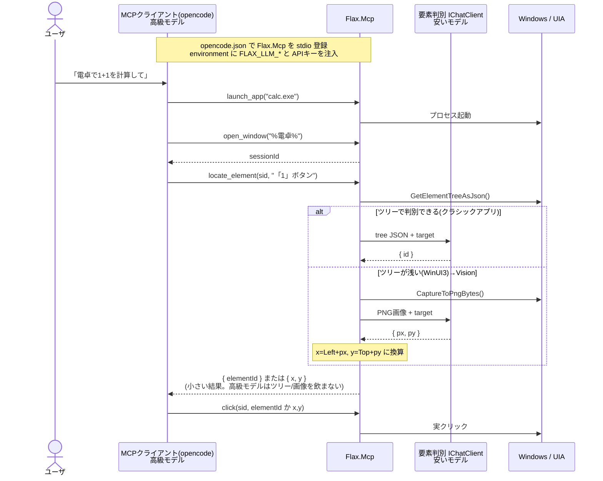
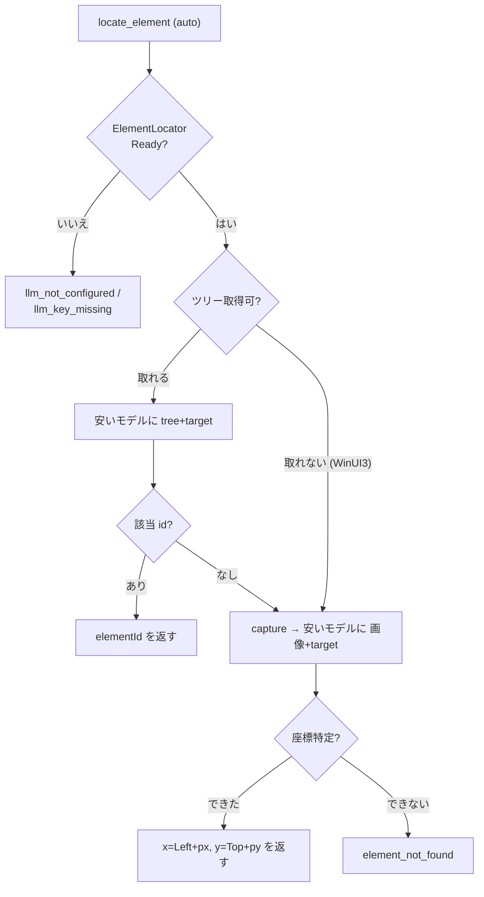

# Flax.Mcp サーバ側「要素判別 LLM」設計書

- 日付: 2026-05-24
- 対象: Flax.Mcp に、設定可能な LLM プロバイダ/キーを持つサーバ側の「UI 要素判別」機能を追加する
- 前提となる既存設計: [2026-05-23-flax-mcp-server-design.md](2026-05-23-flax-mcp-server-design.md)

## 0. 全体像（公開ツール一覧と使用フロー）

本設計後に `Flax.Mcp` が公開するツールは、既存 13（診断 `ping` 含む）+ 新規 `locate_element` の計 14。
`sessionId` 列が「要」のツールは `open_window` が発番したセッションが必要。

| カテゴリ | ツール | 主な入力 | 出力 | sessionId |
|---|---|---|---|---|
| 診断 | `ping` | — | `"pong"` | 不要 |
| ウィンドウ/セッション | `launch_app` | `path`, `args?` | 起動可否 | 不要 |
| 〃 | `list_windows` | — | `[{title,pid,className,rect,minimized}]` | 不要 |
| 〃 | `open_window` | `titleQuery`, `timeoutSec?` | **`sessionId`** + ウィンドウ情報 | 発番 |
| 〃 | `activate_window` | `sessionId` | 結果 | 要 |
| 〃 | `close_window` | `sessionId` | 解放結果 | 要 |
| 要素の取得・判別 | `get_element_tree` | `sessionId`, `maxDepth?`, `includeOffscreen?` | `{ok, tree}` | 要 |
| 〃 | `find_element` | `sessionId`, `name` | `{id, name, rect, center}`（厳密名一致・LLM 不使用） | 要 |
| 〃 | `locate_element` ★新規 | `sessionId`, `target`, `mode?` | `{mode, elementId? \| x,y, confidence?}`（安いモデルで意味判別） | 要 |
| 〃 | `capture_window` | `sessionId` | PNG 画像 + `windowOrigin` | 要 |
| 操作 | `click` | `sessionId`, `{elementId}` か `{x,y}`, `button?`, `double?` | 結果 | 要 |
| 〃 | `type_text` | `sessionId`, `text` | 結果 | 要 |
| 〃 | `send_keys` | `sessionId`, `keys`（例 `"ENTER"`） | 結果 | 要 |
| 〃 | `scroll` | `sessionId`, `lines`, `horizontal?` | 結果 | 要 |

### ツールマップ（4カテゴリ + 要素判別の4経路）



### 使用フロー（要素特定の4経路と分岐）



### 「要素特定」4経路の使い分け

- **`find_element`** — アクセシブル名が分かるクラシックアプリ向け。LLM 不使用で最速・無料。
- **`get_element_tree`** — クライアントの（高級）モデルに構造を渡して判断させる従来経路。トークン消費は大きい。
- **`locate_element`（新規）** — 重い「ツリー/画像 → 目的要素」判別を**サーバ側の安いモデル**へ肩代わりさせ、
  クライアントには `elementId` か `x,y` の小さな結果だけ返す。tree 優先、WinUI3 では vision に自動フォールバック。
- **`capture_window`** — クライアント自身が Vision を持つ場合（Claude Desktop 等）の画像経路。

## 1. 背景と目的

`Flax.Mcp` は標準の stdio MCP サーバで、Claude Desktop / Claude Code に加え、
opencode・Cline など任意の MCP クライアントから利用できる。MCP クライアントは
それぞれ自前の API プロバイダ/キー（Anthropic / OpenAI 等）で「頭脳」を動かす。

本設計の目的は2つ。

1. **マルチクライアント対応の明文化**: opencode 等への登録手順をドキュメント化する
   （サーバはすでに任意クライアントで動くため、コード変更は不要）。
2. **サーバ側の「要素判別 LLM」の追加（本丸）**: UI ツリー／スクリーンショットから
   目的の UI 要素を特定する処理はトークンを大量に消費するが、高級モデルである必要はない。
   この判別だけを、**クライアントのモデルとは独立に設定した安いモデル**へオフロードできるようにする。

### 確定した前提（本設計のブレインストーミングで決定）

- **スタンドアロンホスト（独立エージェント）は作らない。** MCP クライアントが頭脳を担う。
- **対応クライアント**: Claude Desktop / Claude Code に加え opencode・Cline・汎用 stdio。
- **サポートするプロバイダ**: Anthropic / OpenAI / Azure OpenAI の3種。Vision のため画像入力必須。
- **プロバイダ差の吸収方式**: **`Microsoft.Extensions.AI` の `IChatClient`**（.NET 公式の統一抽象）を採用。
  OpenAI / Azure は first-party コネクタ、Anthropic は `Anthropic.SDK` の `IChatClient` 実装で
  ネイティブ API のまま対応。wire 形式の手書きはしない。
- **LLM コードは独立プロジェクトにしない** — `Flax.Mcp` 内（`Flax.Mcp/Llm/`）に置く。
- **設定は環境変数が主**（MCP クライアントの設定が Flax.Mcp プロセスに env 注入する）。
  `appsettings.json` は任意のフォールバック。**API キーは常に環境変数**から読む。
- **サーバ側 LLM はホストのモデルと独立** — 要素判別専用に安いモデルを設定する。

### 解決する課題

`get_element_tree` の JSON や `capture_window` の PNG を**クライアントの高級モデル**が
直接飲み込むと、トークンを浪費する。とりわけ Windows 11 のモダンアプリ（WinUI3/UWP、例: 電卓）は
UIA ツリーが浅くしか取れず、Vision での座標読みが必要になり、画像トークンも増える。
さらに opencode 等で**非 Vision モデル**を設定している場合、`capture_window` の画像を
モデルが読めず WinUI3 アプリが操作できない。

本設計では、サーバ内に設定した安いモデルが「ツリー/画像 → 目的要素」の重い判別を肩代わりし、
クライアントには `elementId` か座標という**小さな結果だけ**を返す。

## 2. アーキテクチャ

別プロジェクトは増やさない。`Flax.Mcp` 内に LLM 層を足すだけ。

```
Flax.Mcp/
├── Program.cs              LlmOptions バインド + ElementLocator を DI 登録（追加）
├── Llm/            ★新規
│   ├── LlmOptions.cs       設定モデル（env 優先 / appsettings フォールバック）
│   ├── ChatClientFactory.cs  LlmOptions → Microsoft.Extensions.AI の IChatClient を構築
│   └── ElementLocator.cs   IChatClient を使った tree/vision 判別ロジック（状態を持つ）
├── Tools/
│   └── InspectionTools.cs  locate_element ツールを追加
└── appsettings.json ★新規  "Llm" セクション（任意フォールバック、キーは書かない）
```

追加 NuGet（`Flax.Mcp.csproj`）:
- `Microsoft.Extensions.AI`（`IChatClient` 抽象・型）
- `Microsoft.Extensions.AI.OpenAI`（OpenAI / Azure OpenAI コネクタ）
- `Anthropic.SDK`（`IChatClient` を実装する Anthropic クライアント）

> 注: `Microsoft.Extensions.AI.OpenAI` は preview の時期がある。実装時にバージョンを固定し、
> 0 エラーでビルドできることを確認する（§9）。

### 設定の独立性（本設計の肝）



## 3. Flax.Mcp 内 LLM 層（Microsoft.Extensions.AI）

### 設定 `LlmOptions`

| プロパティ | 環境変数（主） | appsettings(`Llm:`) | 説明 |
|---|---|---|---|
| `Provider` | `FLAX_LLM_PROVIDER` | `Provider` | `openai` / `azure` / `anthropic`（未設定=機能オフ） |
| `Model` | `FLAX_LLM_MODEL` | `Model` | モデル/デプロイ名（**安いモデル**を指定） |
| `BaseUrl` | `FLAX_LLM_BASE_URL` | `BaseUrl` | 任意。Azure や互換エンドポイント用 |
| `ApiVersion` | `FLAX_LLM_API_VERSION` | `ApiVersion` | Azure 用 |
| `ApiKeyEnvVar` | `FLAX_LLM_API_KEY_ENV` | `ApiKeyEnvVar` | キーを読む環境変数名（既定はプロバイダ別） |
| `MaxOutputTokens` | `FLAX_LLM_MAX_TOKENS` | `MaxOutputTokens` | 既定 1024 |

- 環境変数が `appsettings.json` の `"Llm"` セクションを上書きする。MCP クライアントの設定
  （opencode.json の `environment` など）から env を注入すれば、`appsettings.json` 無しで完結する。
- **API キーは `ApiKeyEnvVar` が指す環境変数**から読む。既定は `openai`→`OPENAI_API_KEY`、
  `azure`→`AZURE_OPENAI_API_KEY`、`anthropic`→`ANTHROPIC_API_KEY`。キーを設定ファイルに置かない。

### `ChatClientFactory`

`static IChatClient Create(LlmOptions o, string apiKey)` がプロバイダ別に `IChatClient` を構築：

- `openai`: OpenAI SDK のクライアントを生成（`BaseUrl` 指定時はエンドポイント差し替え）し、
  `.AsIChatClient(model)` で `IChatClient` 化。
- `azure`: Azure OpenAI クライアントを `BaseUrl`(エンドポイント) + `ApiVersion` + キーで生成し、
  デプロイ名(`Model`) で `.AsIChatClient()`。
- `anthropic`: `Anthropic.SDK` のクライアントが提供する `IChatClient`（モデル=`Model`）。

3 プロバイダの wire 差はコネクタ側が吸収。本コードはプロバイダ選択と資格情報の受け渡しだけ。

### `ElementLocator`（常に DI 登録、状態を持つ）

DI で常に登録し、構築時に設定状態を判定する（MCP ツールの引数注入を壊さないため、
未設定でもインスタンスは存在し、`Status` で分岐する）。

- `Status`: `Ready` / `NotConfigured`（`Provider` 未設定）/ `KeyMissing`（キー env 空）。
- `Task<LocateResult> LocateInTreeAsync(string treeJson, string target, ct)`:
  system + user(テキスト) で `IChatClient.GetResponseAsync` を呼び、応答テキストから
  `{ found, id, confidence?, reasoning? }` を解析。
- `Task<LocateResult> LocateByVisionAsync(byte[] png, string target, ct)`:
  user メッセージに `DataContent(png, "image/png")` を載せ、`{ found, px, py, confidence?, reasoning? }`
  を解析。
- 応答が JSON として解析不能なら `found=false` + 生テキスト断片を `reasoning` に。

## 4. `locate_element`（Flax.Mcp の新ツール）

`Tools/InspectionTools.cs` に追加（既存ツールと同じ `ToolRunner.Run` パターン）。
DI で `SessionManager` と `ElementLocator` を受け取る。

- **入力**: `sessionId`, `target`（自然言語、例 `"「1」ボタン"`）, `mode?`（`auto` 既定 / `tree` / `vision`）
- **動作**:
  1. `ElementLocator.Status` が `Ready` でなければ即エラー（`llm_not_configured` / `llm_key_missing`）。
  2. **tree モード**: `window.GetElementTreeAsJson()` の JSON ＋ `target` を `LocateInTreeAsync` に渡し、
     該当 `id` を得る。→ クライアントはツリーを受け取らずに済む（トークン節約の本丸）。
  3. **vision モード**: `window.CaptureToPngBytes()` の PNG ＋ `target` を `LocateByVisionAsync` に渡し、
     画像内ピクセル `(px,py)` を得て、**画面座標** `x=Left+px, y=Top+py` に換算して返す。
  4. **auto**: tree を試し、ツリー取得不可（`GetElementTreeAsJson==null`、WinUI3）または `found:false`
     の場合に vision へ自動フォールバック。
- **出力（成功）**: `{ ok:true, mode:"tree"|"vision", elementId?, x?, y?, confidence?, reasoning? }`
  - tree → `elementId`、vision → `x,y`(画面絶対座標)。どちらも既存 `click` にそのまま渡せる。
- **出力（エラー）**: `{ ok:false, error, hint }`。
  - `session_not_found` / `llm_not_configured` / `llm_key_missing` / `llm_error`（API 失敗）/
    `element_not_found`（tree・vision とも該当なし）。

### 既存ツールとの関係

- `get_element_tree` / `capture_window` は**据え置き**。自前で判別したいクライアント（高級 Vision を
  持つ Claude Desktop 等）は従来どおり使える。`locate_element` は安いモデルへオフロードしたい
  クライアント向けの追加経路。
- `find_element`（アクセシブル名の厳密一致、LLM 不使用）と `locate_element`（意味的判別、LLM 使用）は
  役割が異なり共存する。

## 5. データフロー（opencode + 安いモデルで「電卓の1ボタン」）



`locate_element` 内部の `auto` 判定：



## 6. マルチクライアント・ドキュメント（README 追記）

- **opencode**: `opencode.json` の `mcp` に Flax.Mcp.exe を stdio 登録し、`environment` に
  `FLAX_LLM_PROVIDER` / `FLAX_LLM_MODEL` と APIキー（`OPENAI_API_KEY` 等）を `{env:...}` で注入する例。
- **Cline / 汎用 stdio クライアント**: 同様の stdio + env 注入例。
- 棲み分けの明記: 「クライアント側で各自の API キーを設定する」前提と、
  「**Flax.Mcp 側の `Llm` 設定は要素判別専用の安いモデル**（任意・未設定でも他ツールは動く）」。
- `appsettings.json` の `"Llm"` 設定例とプロバイダ別 env var 一覧。秘密情報を含まないため
  `appsettings.json` はコミット可。`appsettings.*.local.json` は `.gitignore`。

## 7. エラー処理

ツールは例外を投げず、構造化結果 `{ ok, error, hint }` を返す（既存方針を踏襲）。

| error | 状況 |
|---|---|
| `session_not_found` | 不正/期限切れ sessionId |
| `llm_not_configured` | `Provider` 未設定（→「クライアント側で判別するか Llm を設定」） |
| `llm_key_missing` | プロバイダ設定済みだがキー環境変数が空 |
| `llm_error` | API 呼び出し失敗 / 応答 JSON 解析失敗 |
| `element_not_found` | tree・vision とも該当要素を特定できず |

## 8. テスト

別テストプロジェクトは作らず、既存 `Flax.Mcp.Tests` に追加する。

- **LlmOptions バインド**: env が `appsettings` を上書き、未設定/キー欠如で `Status` が
  `NotConfigured`/`KeyMissing` になることを検証（実 API 呼び出しなし）。
- **ElementLocator**: `IChatClient` は interface なので**フェイク**に差し替え、
  scripted な応答テキストで `LocateInTreeAsync`/`LocateByVisionAsync` の解析
  （`found`/`id`/`px,py`、JSON 解析失敗時の `found=false`）を検証。
- **locate_element ツール**: フェイク `ElementLocator`/`IChatClient` で——
  tree ヒット→`elementId`、tree ミス→vision フォールバック→画面座標換算、
  `llm_not_configured`/`llm_key_missing`/`llm_error` の各封筒を検証。
- **統合スモーク**: 実 API キーで課金が発生するため `[Explicit]`（CI スキップ）。

## 9. 未確定・要検証項目

- `Microsoft.Extensions.AI` / `Microsoft.Extensions.AI.OpenAI` / `Anthropic.SDK` の
  バージョン固定と、`net8.0-windows` 上で 0 エラーでビルドできること。
- 各コネクタの `IChatClient` 取得 API の正確な呼び出し方（`AsIChatClient` 等）と、
  画像入力（`DataContent`）の対応可否。
- 判別タスクに適した安価モデルの実名（OpenAI/Anthropic/Azure それぞれ）。
- `locate_element` に渡すツリー JSON のサイズ上限（巨大ツリー時の切り詰め要否）。
- vision モードの座標精度（DPI スケーリング下での `Left/Top` 換算）。
